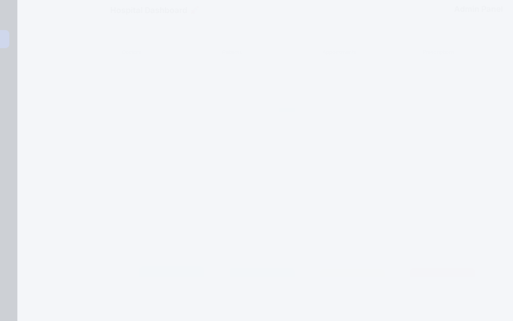
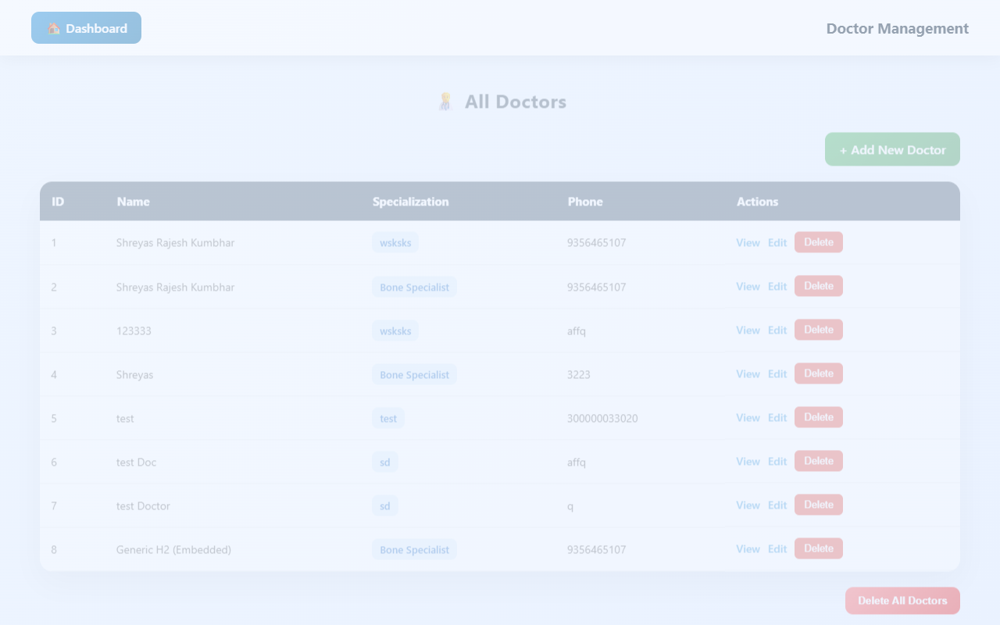
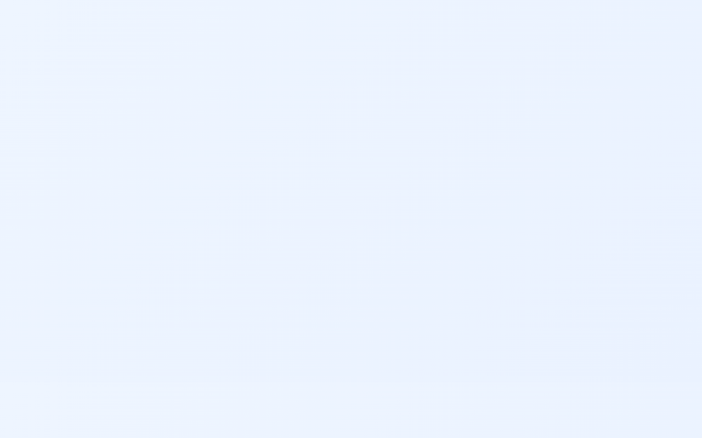

# 🏥 Hospital Management System (HMS)

A modern, responsive, and robust **Hospital Management System** built using **Spring Boot**, **Spring Data JPA**, **Thymeleaf**, and **MySQL**. This application provides administrative panels to seamlessly manage doctors, patients, appointments, and prescriptions with clean CSS transitions and real-time dashboard analytics powered by **Chart.js**.

---

## 🌟 Key Features

### 📊 Interactive Dashboard
- Real-time counts of doctors, patients, appointments, and prescriptions.
- Interactive, responsive bar chart visualizing statistics using **Chart.js**.
- Modern fluid animations (fade-in, slide-left navigation, pop-in stats cards).

### 👨‍⚕️ Doctor Management
- List all active doctors with specialization and contact information.
- Add new doctors with validation checks.
- Edit details or remove doctor profiles.

### 🧑 Patient Directory
- Track patient demographics including Name, Age, Address, Email, and diagnosed Disease.
- Complete CRUD capabilities for medical records.
- Input validation to ensure data consistency.

### 📅 Appointment Scheduling
- Link patients and doctors to schedule consults on specific dates.
- Manage statuses (e.g., Pending, Confirmed, Completed).
- View all appointments in a centralized registry.

### 💊 Prescription Management
- Track medications, precise dosages, and custom clinician notes.
- Associate each prescription uniquely with a scheduled appointment.

---

## 📸 Application Screenshots

### 🏠 Main Dashboard & Analytics
The landing dashboard shows a summary of hospital operations and a Chart.js graphical chart representing data distribution.



### 👨‍⚕️ Doctors Directory
A clean, responsive table layout for managing doctors' profiles, specializations, and details.



### 🧑 Patients Directory
Comprehensive list displaying patient info, age, address, and diagnosed health conditions.



### 📅 Appointments Registry
Scheduled consults detailing doctor, patient, date, and status.


### 💊 Prescriptions Log
Record of assigned medications, dosage guides, and associated appointments.


### 📅 Add Appointment Form
Form validation and dropdown selection of doctors and patients for scheduling consults.


---

## 🛠️ Tech Stack & Architecture

- **Backend Framework**: Spring Boot 4.0.5 (Java 24)
- **Persistence Layer**: Spring Data JPA / Hibernate
- **Database**: MySQL 8.x
- **Template Engine**: Thymeleaf (HTML5 / CSS3 / Vanilla JavaScript)
- **Frontend Charting**: Chart.js (CDN-integrated)
- **Styling**: Modern CSS3 (Inter font, responsive flex-grid grid layout, animations, gradients)
- **Build Tool**: Maven

---

## 🚀 Getting Started & Setup

### 1. Prerequisites
Ensure you have the following installed on your machine:
- **Java JDK 24** or higher
- **MySQL Server 8.0+**
- **Apache Maven** (or use the included wrapper `./mvnw`)

### 2. Database Configuration
1. Start your local MySQL instance.
2. Create the target schema:
   ```sql
   CREATE DATABASE hospital_db;
   ```
3. Open `src/main/resources/application.properties` and update the datasource credentials:
   ```properties
   spring.application.name=stud-man
   spring.datasource.url=jdbc:mysql://localhost:3306/hospital_db
   spring.datasource.username=YOUR_MYSQL_USERNAME
   spring.datasource.password=YOUR_MYSQL_PASSWORD
   spring.jpa.hibernate.ddl-auto=update
   ```

### 3. Build & Run
From the root of the project, execute:
```bash
# Compile and run using Maven wrapper
./mvnw spring-boot:run
```

Once started, open your web browser and navigate to:
👉 **[http://localhost:8080/dashboard](http://localhost:8080/dashboard)**

---

## 📂 Project Structure

```
hospitalMngtSys
 ├── src/main/java/com/hospital/hospitalMngtSys
 │    ├── controller      # MVC Controllers (Web routes)
 │    ├── entity          # JPA Domain Entities
 │    ├── repository      # JPA Spring Data Repositories
 │    └── service         # Core business logic classes
 ├── src/main/resources
 │    ├── templates       # Thymeleaf HTML Templates
 │    ├── static/css      # UI Stylesheets
 │    └── application.properties
 ├── screenshots          # Application execution screenshots
 ├── pom.xml              # Maven dependencies and build settings
 └── README.md            # Project documentation
```
